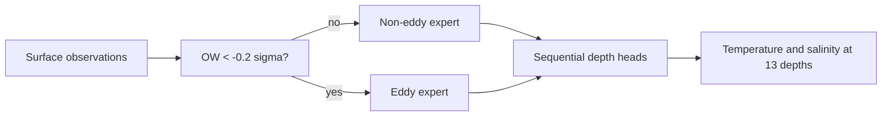

# Conditional Computation Model for Ocean Subsurface Reconstruction

Python research code for reconstructing 13-level subsurface temperature and salinity profiles in the East Sea. The model accompanies Kim et al. (2026), *A Wobbling Ratio for diagnosing phase evolution of the Ulleung Warm Eddy from its three-dimensional tilt structure*.

> Status: author-review release candidate. The model, processed-data interface, recovered preprocessing rules, evaluation tools, tests, and result table are organized. Raw observations, bulk MATLAB files, and trained weights remain excluded until redistribution permission and the release license are confirmed.

## Why conditional computation?

Eddy observations are much less common than non-eddy observations. A single regressor can therefore be dominated by the majority regime. CCM retains all samples but routes each one to an independent expert using an upstream Okubo-Weiss (OW) label:



Only one expert runs for each sample. The experts have the same architecture and do not share weights.

## Recovered input versions

Two internally consistent versions were found and are kept separate in code:

| Layout | Raw shape | Spatial channels | Point channels | Routing | Evidence |
|---|---|---:|---:|---:|---|
| `final_checkpoint_9spatial` | `(8, 8, 13, N)` | 9 | 3 | 1 | `model_epoch_996.pth` and its final evaluator |
| `take5_10spatial` | `(8, 8, 14, N)` | 10 | 3 | 1 | later `take5/cnn.py` and `dataset3.mat` |

The selected final checkpoint uses SSH, wind u/v, tidal elevation/current u/v, longitude, latitude, and bathymetry as its nine spatial channels. SST, SSS, and day of year are point inputs. The final routing channel is the binary eddy flag. The later take5 version inserts net heat flux before longitude, producing ten spatial channels.

This distinction is material: the epoch-996 checkpoint's first gated-convolution weights have shape `(20, 9, 3, 3)`. See [publication-to-code alignment](docs/PAPER_ALIGNMENT.md).

## Model I/O and architecture

Model-ready inputs are:

- spatial patch: `(N, 9, 8, 8)` for the recovered final checkpoint, or `(N, 10, 8, 8)` for take5;
- SST, SSS, day of year: `(N, 3)`;
- preceding pressure: `(N, 13)`;
- binary eddy signal: `(N, 8, 8)`.

The output is `(N, 13, 2)` for temperature and salinity at approximately 10, 20, 30, 50, 75, 100, 125, 150, 200, 250, 300, 400, and 500 m.

Each expert combines a gated-convolution spatial encoder with a `3 -> 6 -> 12 -> 24` point encoder. Thirteen depth-specific heads predict the profile sequentially; each head after the first also receives the preceding temperature, salinity, and pressure.

## Installation

Python 3.10 or newer is recommended.

```bash
python -m venv .venv
.venv\Scripts\activate
python -m pip install -e ".[dev]"
```

No MATLAB installation is required for the cleaned model, training, evaluation, or deterministic post-matching preprocessing modules.

## Recovered checkpoint evaluation

Keep authorized local copies outside Git, then convert the legacy normalization files:

```bash
python scripts/convert_legacy_normalization.py ^
  --source artifacts/legacy_model_condition ^
  --output artifacts/normalization/final_epoch996.npz ^
  --feature-layout final_checkpoint_9spatial

python scripts/evaluate.py ^
  --data data/independent/dataset_ARGO_final.mat ^
  --checkpoint checkpoints/model_epoch_996.pth ^
  --normalization artifacts/normalization/final_epoch996.npz ^
  --feature-layout final_checkpoint_9spatial ^
  --pool-mode max ^
  --vector-grid-index 0 0 ^
  --missing-value-policy preserve ^
  --output outputs/metrics.json
```

Verify generated profiles against the historical MATLAB output:

```bash
python scripts/verify_epoch996_regression.py ^
  --data data/independent/dataset_ARGO_final.mat ^
  --checkpoint checkpoints/model_epoch_996.pth ^
  --normalization artifacts/normalization/final_epoch996.npz ^
  --reference artifacts/legacy_model_condition/model_result.mat
```

The recovered CCM/non-CCM depth curves are provided as [a compact CSV](results/depth_metrics.csv). They can be regenerated from the two local `model_result.mat` files with `scripts/export_legacy_results.py`.

## Training

```bash
python scripts/train.py --config configs/paper_reported.yaml
```

The default research configuration uses the later 14-channel take5 layout, average pooling, sentinel missing-value handling, and the focal-Huber gamma values found in `take5/cnn.py`: 1.5 for non-eddy and 2.0 for eddy. It is not claimed to recreate the 9-channel epoch-996 checkpoint, whose exact training script has not been recovered.

## What is included

```text
configs/       explicit recovered training profiles
docs/          model, data, results, provenance, and release audit
results/       compact numeric metrics only
scripts/       train, evaluate, predict, and legacy-conversion commands
src/ocean_ccm/ reusable model and preprocessing modules
tests/         data-layout, preprocessing, metric, and model tests
```

Large `.mat`, `.pth`, `.h5`, prediction arrays, and repeated experiment folders are intentionally ignored. See the [data card](docs/DATA_CARD.md) and [preprocessing migration](docs/PREPROCESSING_MIGRATION.md).

## Authorship, citation, and contact

The provisional software author and maintainer is Dong-Young Kim. Paper coauthors remain credited in the preferred article citation in [`CITATION.cff`](CITATION.cff); anyone who materially contributed code, software design, testing, or documentation should be added as a software contributor before release.

Contact: [kdy8706@naver.com](mailto:kdy8706@naver.com)

## License

No software license has been selected yet. Until a license file is added, the repository does not grant reuse or redistribution rights. A permissive BSD-3-Clause license is recommended for the code, subject to author approval. Data and weights require separate permission review.
