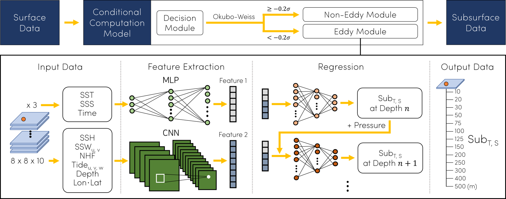

# Conditional Computation Model for Ocean Subsurface Reconstruction

This repository reconstructs 13-level subsurface temperature and salinity
profiles in the East Sea from satellite-based surface fields and 0 m in-situ
observations. It accompanies Kim et al. (2026), *A Wobbling Ratio for
diagnosing phase evolution of the Ulleung Warm Eddy from its three-dimensional
tilt structure*.


## Why Conditional Computation?



### The scientific and learning problem

The objective is not merely to interpolate a subsurface profile. It is to infer
how temperature and salinity vary from 10 to 500 m under dynamically different
surface conditions, including mesoscale eddies. A profile is assigned to the
eddy regime when its upstream Okubo-Weiss (OW) criterion satisfies
`OW < -0.2 sigma`; this is the operational meaning of an "eddy profile" in
this project, rather than a vague label of "eddy observations."

The eddy regime is underrepresented relative to the non-eddy regime in the
training collection. This is an imbalance between **routing regimes**, not a
claim that the continuous temperature or salinity targets are class labels.
Learning from underrepresented groups can cause conventional learners to favor
the majority group; this general issue is reviewed by
[He and Garcia (2009)](https://doi.org/10.1109/TKDE.2008.239). The inspected
data counts and their remaining reconciliation notes are recorded in the
[data card](docs/DATA_CARD.md).

### Why use CCM rather than one regressor?

A single regressor trained on all profiles can be dominated by the more common
non-eddy regime. CCM keeps all samples, but its decision module sends each
sample to either an eddy or non-eddy expert. The experts have the same
architecture and separate weights; only the selected expert runs for that
sample. This gives the less frequent eddy regime its own prediction pathway
while retaining a shared, reproducible data interface.

The architecture is an ocean-reconstruction application of input-dependent
conditional computation: a gating decision selects the computation used for a
given input. [Bengio, Leonard, and Courville (2013)](https://arxiv.org/abs/1308.3432)
and [Bengio et al. (2016)](https://arxiv.org/abs/1511.06297) provide the
methodological background for conditional, input-dependent activation. They do
not by themselves establish the ocean-specific imbalance; that motivation comes
from the documented composition of this project's data.

### How CCM represents the ocean problem

Each expert combines two complementary feature paths:

- A CNN extracts horizontal structure from the surface patch: sea-surface
  height, wind, tide, bathymetry, net heat flux, and related gridded fields.
- An MLP encodes the point variables: 0 m in-situ SST and SSS, together with
  day of year. These surface observations retain the local thermohaline state.

The two feature representations are combined before depth-wise regression.
Thirteen depth heads predict temperature and salinity sequentially. After the
first level, each head receives the preceding predicted temperature, salinity,
and pressure through residual conditioning. This lets the model carry
information from the preceding water layer while learning vertical
thermohaline-transport structure, and it keeps a clear location for a future
equation relating depth `n` to `n + 1`.

### Scientific background and design references

The following references describe why these inputs and connections were chosen;
they are not all claims that CCM reproduces the cited methods exactly.

| Reference | Contribution to this repository's design |
|---|---|
| [Kim et al. (2026)](docs/references/Kim%20et%20al.%2C%202026.pdf) | East Sea eddy context and the scientific need to represent three-dimensional thermohaline structure. |
| [Ocean 3-D temperature conservation note](docs/references/ocean_3D_temperature_conservation_equation.txt) | Physical motivation from advection, mixing, and surface forcing; especially the vertical transport terms that motivated sequential residual depth heads. CCM is not a numerical conservation-equation solver. |
| [Liu et al. (2024)](docs/references/liu%20et%20al.%2C%202024%20%2B%20tilting.pdf) | Satellite-observation and deep-learning reconstruction of three-dimensional eddy thermohaline structure. |
| [Yu et al. (2022)](docs/references/yu%20et%20al.%2C%202022%20%2B%20tide.pdf) | Motivation for retaining tidal information among the surface inputs for subsurface thermal inversion. |
| [Kim et al. (2023)](docs/references/README.md#referenced-but-not-stored) | CNN-based subsurface-salinity estimation, supporting the use of a spatial CNN pathway for thermohaline reconstruction. |
| [Complete reference notes](docs/references/README.md) | Full citation list, including the methodological conditional-computation and imbalance references. |


> **Start here:** this workflow is written for a first-time user. It uses the
> published `v0.1.0` Release and the current `main` branch, without
> undocumented local paths. The Release is access-controlled while this
> repository is private: sign in to GitHub with repository read access first.

## What you can reproduce

| Goal | Included inputs | Result |
|---|---|---|
| Evaluate the released checkpoint | execution package + archive `testset.mat` | depth-resolved temperature/salinity metrics on the archived held-out split |
| Retrain one archived split | archive `trainset.mat` + `testset.mat` | `best.pth`, `last.pth`, normalization statistics, and validation loss |
| Repeat the original 20-attempt sweep | same archive plus your own automation | not automated by `train.py`; the archive preserves 500 historical checkpoints |
| Independent external validation | your own 14-channel MATLAB dataset | optional; not included in Release v0.1.0 |

The supplied `testset.mat` is a held-out split from the archived workflow. It
is **not** an independent external validation dataset.

## Release assets

Download both assets from [Release v0.1.0](https://github.com/kdy8706/Conditional-Computation-Model/releases/tag/v0.1.0).

| Asset | Size | Purpose |
|---|---:|---|
| [`ccm-take5-epoch996-v0.1.0.zip`](https://github.com/kdy8706/Conditional-Computation-Model/releases/download/v0.1.0/ccm-take5-epoch996-v0.1.0.zip) | ~2 MB | User-designated checkpoint, four matching normalization files, configuration, and checksums |
| [`last_result.1.zip`](https://github.com/kdy8706/Conditional-Computation-Model/releases/download/v0.1.0/last_result.1.zip) | ~1.06 GB | Full archived attempt: source `cnn.py`, 500 checkpoints, train/test splits, normalization files, and historical results |

`last_result.1.zip` is the published filename of the locally named
`last_result(1).zip` archive. They refer to the same archive.

The release checkpoint is `13/model_epoch_996.pth` in the full archive. It is
a take5 model with 10 spatial channels and average pooling. Verify it before
use:

```text
SHA-256 (model_epoch_996.pth)
79b6a661d77eca4fb8ca8c7d978a530e54234e8ea77a8b0941c09e1887766e02
```

## 1. Install

Clone the current `main` branch. Do not use the automatically generated source
ZIP attached to the older `v0.1.0` tag: the current branch includes support for
the archived `trainset.mat` and `testset.mat` layout.

```powershell
git clone https://github.com/kdy8706/Conditional-Computation-Model.git
cd Conditional-Computation-Model

python -m venv .venv
.\.venv\Scripts\Activate.ps1
python -m pip install --upgrade pip
python -m pip install -e ".[dev]"
python -m pytest -q
```

Requirements are Python 3.10 or newer plus the packages declared in
`pyproject.toml`: NumPy, SciPy, PyTorch, torch-optimizer, PyYAML, and pytest
for tests. CPU execution is supported; a CUDA GPU is optional. Leave at least
3 GB of free disk space for the Release archive, Python environment, and run
outputs; 8 GB RAM or more is recommended.

## 2. Create the documented local layout

In the repository root, create `artifacts/release/`. Download the two Release
assets through the GitHub Release page, then extract them so the layout is
exactly:

```text
Conditional-Computation-Model/
├─ artifacts/
│  └─ release/
│     ├─ execution/                         # extract ccm-take5-epoch996-v0.1.0.zip here
│     │  ├─ model_epoch_996.pth
│     │  ├─ input_normalization.mat
│     │  ├─ output_normalization_t.mat
│     │  ├─ output_normalization_s.mat
│     │  └─ pressure_normalization.mat
│     └─ archive/                           # extract last_result.1.zip here
│        ├─ cnn.py
│        └─ 13/
│           ├─ trainset.mat
│           ├─ testset.mat
│           ├─ model_result.mat
│           └─ model_epoch_10.pth ... model_epoch_998.pth
├─ configs/release_archive_take5.yaml
└─ scripts/
```

The archive's `13/trainset.mat` provides `xtrain`, `ytrain`, and
`pressure_train`; `13/testset.mat` provides `xtest`, `ytest`, and
`pressure_test`. Both have the verified take5 shape `(8, 8, 14, N)` and can be
read directly by the current code.

Check this layout, the checkpoint checksum, the 10-channel model signature,
and both MATLAB split files before training or evaluation:

```powershell
python scripts/preflight_release.py
```

## 3. Verify the released checkpoint on the archived test split

Run these commands from the repository root. This is the shortest complete
reproduction path and uses the matching checkpoint and normalization files.

```powershell
python scripts/convert_legacy_normalization.py `
  --source artifacts/release/execution `
  --output artifacts/release/take5_epoch996.npz `
  --feature-layout take5_10spatial

python scripts/evaluate.py `
  --data artifacts/release/archive/13/testset.mat `
  --checkpoint artifacts/release/execution/model_epoch_996.pth `
  --normalization artifacts/release/take5_epoch996.npz `
  --feature-layout take5_10spatial `
  --pool-mode avg `
  --vector-grid-index 0 0 `
  --missing-value-policy sentinel `
  --output outputs/release_test_metrics.json
```

Success creates `outputs/release_test_metrics.json`, containing R2, RMSE,
relative RMSE, MAE, and normalized RMSE at each of the 13 depth levels for
temperature and salinity. Do not change `take5_10spatial`, `avg`, or
`sentinel` when evaluating this released checkpoint.

## 4. Retrain the released archived split

The supplied configuration already points to the directory layout above. It
uses the ZIP-verified settings: 10 spatial channels, average pooling, 13 depth
levels, dropout 0.2, batch size 5,000, learning rate 0.0005, and 1,000 epochs.

```powershell
python scripts/train.py --config configs/release_archive_take5.yaml
```

Outputs are written to `runs/release_archive_take5/`:

```text
best.pth                 lowest validation loss from this run
last.pth                 checkpoint from epoch 1,000
stats.npz                training-split normalization statistics
split_indices.npz        archived train/test index ranges
resolved_config.yaml     exact configuration used
```

The historical archive used 20 attempts and retained 500 intermediate
checkpoints (every two epochs). The refactored trainer intentionally runs one
configured attempt. To repeat a 20-attempt sweep, run this command in separate
output directories with explicitly recorded seeds and compare held-out metrics
before selecting a checkpoint.

## Data interface and compatibility

The released workflow uses `take5_10spatial`:

- `Dinput2` or the archived split input: `(8, 8, 14, N)`;
- 10 spatial fields, including net heat flux;
- SST, SSS, and day of year as three point inputs;
- the 14th channel as the binary eddy-routing signal;
- targets: `(N, 13, 2)` for temperature and salinity; and
- pressure: `(14, N)`.

The model routes each sample to an eddy or non-eddy expert. A CNN extracts
spatial-patch features, while an MLP encodes the surface point variables.
Thirteen depth heads predict sequentially; after the first level, each head
receives the preceding temperature, salinity, and pressure through residual
conditioning.

This division expresses two parts of the physical problem: the CNN retains
horizontal surface structure, while the MLP incorporates the local 0 m
in-situ SST and SSS used as surface thermohaline conditions. The residual
depth-to-depth connection lets a deeper prediction use the preceding water
layer, which was designed to help learn vertical temperature and salinity
transport and leaves a clear location for a future mathematical formulation.

The input choices and sequential structure were informed by the
[temperature-conservation note](docs/references/ocean_3D_temperature_conservation_equation.txt)
and the related studies retained in [docs/references](docs/references). CCM is
a data-driven reconstruction model, not a numerical solver of those equations.

The codebase also preserves a historical `final_checkpoint_9spatial` layout.
It is not the v0.1.0 release target. Never evaluate the published take5
checkpoint with that 9-channel/max-pooling configuration.

## Independent evaluation

To evaluate another 14-channel MATLAB dataset, it must contain `Dinput2`,
`Doutput2`, and `Dpressure2` with the shapes above. Reuse the commands in
step 3 but replace only `--data`; keep the released checkpoint's take5 layout,
average pooling, and sentinel missing-value policy. Clearly label those
results as independent evaluation and record the dataset provenance.

## References and project files

- [Reproducibility guide](docs/REPRODUCIBILITY.md)
- [Data card](docs/DATA_CARD.md)
- [Model-selection policy](docs/MODEL_SELECTION.md)
- [Reference output for the released test split](results/release_test_metrics.json)
- [Physical motivation and references](docs/references/README.md)
- `configs/`: training profiles
- `scripts/`: training, evaluation, normalization conversion, prediction, and
  result-export utilities
- `tests/`: data-layout, preprocessing, metrics, and model tests

## Citation, access, and license

The provisional software author and maintainer is Dong-Young Kim. See
[`CITATION.cff`](CITATION.cff) for citation details; contact
[kdy8706@naver.com](mailto:kdy8706@naver.com) for questions.

The Release includes the author-authorized archive and weights. No software
license has yet been selected, so publication does not by itself grant a broad
reuse or redistribution license. Add an explicit license before representing
the repository as openly reusable.


