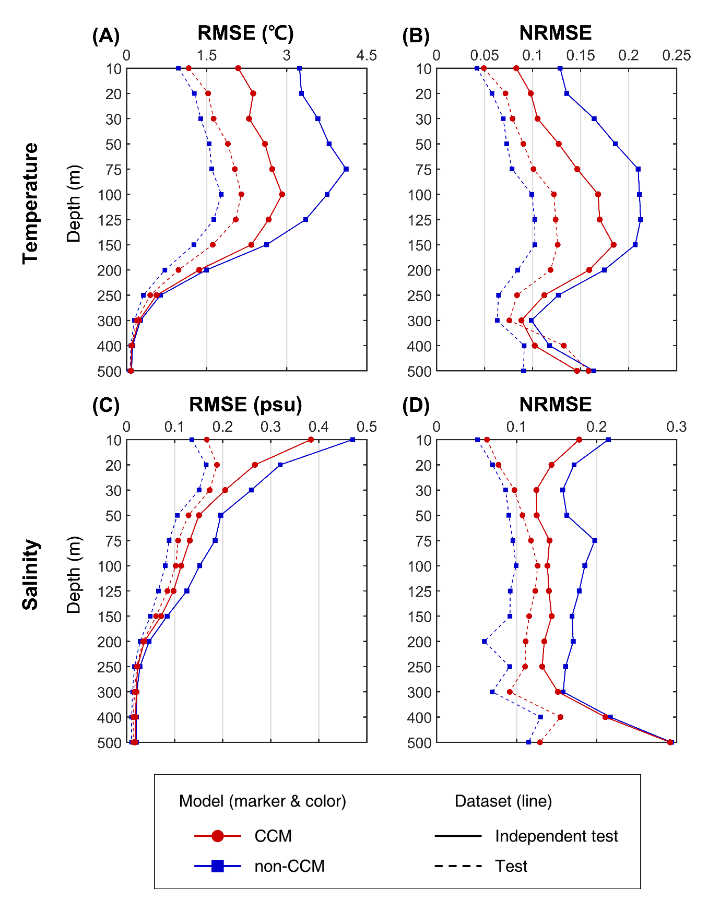

# Recovered results

## Final comparison artifacts

The October 2025 result folder identifies:

- CCM: `model_epoch_996.pth`;
- non-CCM: `cnn_100_300_55.h5`;
- held-out sample counts: 1,973 for CCM and 1,956 for non-CCM;
- independent result arrays: 8,091 profiles for both models.

The full depth-wise R2, RMSE, MAE, and NRMSE values are in [`results/depth_metrics.csv`](../results/depth_metrics.csv). This table contains metrics only, not observations or profile predictions.

## Aggregate diagnostic summary

| Dataset | Variable | CCM mean RMSE | non-CCM mean RMSE | Interpretation |
|---|---|---:|---:|---|
| held out | temperature | 1.218 degC | 0.982 degC | non-CCM lower |
| held out | salinity | 0.0856 psu | 0.0708 psu | non-CCM lower |
| independent | temperature | 1.717 degC | 2.333 degC | CCM lower |
| independent | salinity | 0.1184 psu | 0.1484 psu | CCM lower |

This supports the reviewer-response interpretation that the selected CCM traded some held-out performance for substantially better independent-set robustness. It does not by itself establish that the 8,091-profile artifact is identical to the paper's previously described 4,100-profile independent set.

## Depth-resolved comparison



The recovered result files show the strongest independent-set CCM advantage in upper and intermediate depths. At deep salinity levels, R2 becomes negative for both models because the observed variance is very small; RMSE remains the more interpretable quantity there.

## Published values kept separate

The article reports, for its Ulleung Basin independent subset, temperature RMSE below 1.62 degC and salinity RMSE below 0.07 psu across the reported depths. Those claims should remain cited to the paper until the relationship between the paper dataset and the final 8,091-profile result artifact is confirmed.

## Regeneration

```bash
python scripts/export_legacy_results.py ^
  --ccm path/to/model_condition/model_result.mat ^
  --non-ccm path/to/model_not_condition/model_result.mat ^
  --output results/depth_metrics.csv
```
